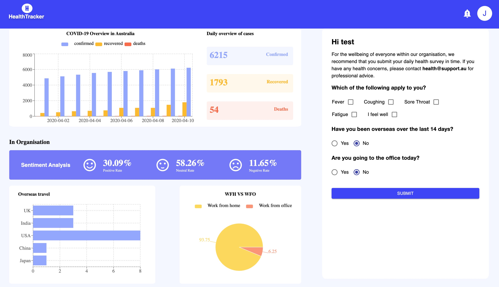

# HealthTracker

HealthTracker is an interactive website that provides key statistics on physical and mental health of people in your organisation amid COVID-19, empowering employers and employees to make informed decisions on staff support and work arrangements.

*This project was implemented during the Hackathon hosted by Australian Computer Society (ACS) #FlattenTheCurveHack*

## Key Features

1. Learn up-to-date key stats about COVID-19 in Australia
2. Track health status and overseas travel within organisation
3. Log your health information and see how others are doing
4. Mental health assessment powered by AI technology

## Landing Page

## Dashboard

## Technologies & Architecture

## About Team Eureka

Team Members:

- Frank Gu

- Hanwei Zhu

- Jie He

- Yifei Ma

